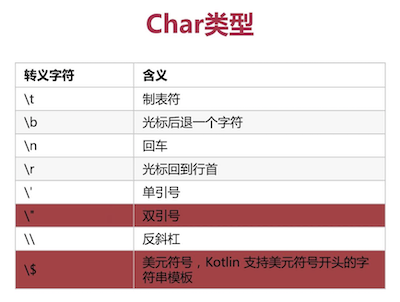

# Kotlin笔记（二） - 数据类型

* 2.1、Boolean数据类型
* 2.2、Number数据类型
* 2.3、拆箱装箱与Char数据类型
* 2.4、基础数据类型转换与字符串
* 2.5、类和对象
* 2.6、空类型和智能类型转换
* 2.7、包（package）
* 2.8、区间（Range）
* 2.9、数组（Array）

## 2.1、Boolean数据类型
> Demo见：BooleanDataType.kt

Boolean 数据类型只有 true 和 false 两种值。
```
val aBoolean:Boolean = true
val otherBoolean:Boolean = false
```

## 2.2、Number数据类型
> Demo见：NumberDataType.kt

Kotlin 的 Number 数据类型对比 Java 的，将拆装箱合为一体，没有具体的区分拆箱和装箱。


## 2.3、拆箱装箱与Char数据类型
> Demo见：CharDataType.kt



Char类型：
* 字符对应 Java 的 Character；
* 占两个字节，表示一个16位的 Unicode 字符；
* 字符用单引号 '' 引起来，例如：'a','0','\n'。

## 2.4、基础数据类型转换与字符串
> Demo见：StringDataType.kt

在 java 中，可以用高精度的基础数据类型去接收低精度的基础数据类型，如 float 声明的变量，可以接收 int 声明的变量，但是在 kotlin 中不支持这种方式。</br>
kotlin 中不支持隐式转换，只能通过以下方式接收：
```
val anInt:Int = 5
val aLong:Long = anInt.toLong()
```

kotlin 中的字符串：
* 字符串就是一串 char；
* kotlin 中的 == 与 java 中的 equals() 是等价的；
* kotlin 如果相比较两个对象是否相等，使用 === 。

kotlin 的字符串模版</br>
在 kotlin 中，拼接两个字符串也可以像 java 一样使用 + 号进行拼接，但是 kotlin 有一种更优雅的写法，就是字符串模板。</br>
kotlin 使用 $ 符进行引用和占位，也可以使用 ${} 进行运算<br>  
```
val arg1: Int = 1
val arg2: Int = 2
println("$arg1+$arg2=${arg1 + arg2}")
```

如果我们想打印 $ 符号，需要对它进行转义：
```
val money: Int = 1000
println("\$$money")
```

在 kotlin 中，如果想打印原始字符串，使用一对三个引号包裹起来的就可以了：
```
val rawString = """\\\\\\$$money
        \n
        \t"""
println(rawString)
```