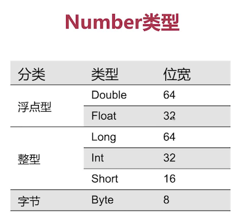

# Kotlin笔记（二） - 数据类型

* 2.1、Boolean数据类型
* 2.2、Number数据类型
* 2.3、拆箱装箱与Char数据类型
* 2.4、基础数据类型转换与字符串
* 2.5、类和对象
* 2.6、空类型和智能类型转换
* 2.7、包（package）
* 2.8、区间（Range）
* 2.9、数组（Array）

## 2.1、Boolean数据类型
> Demo见：BooleanDataType.kt

Boolean 数据类型只有 true 和 false 两种值。
```
val aBoolean:Boolean = true
val otherBoolean:Boolean = false
```

## 2.2、Number数据类型
> Demo见：NumberDataType.kt

Kotlin 的 Number 数据类型对比 Java 的，将拆装箱合为一体，没有具体的区分拆箱和装箱。



